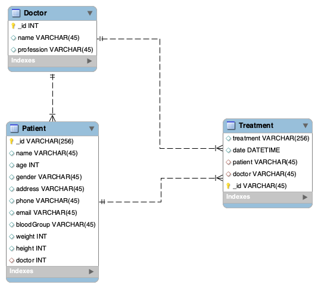

<!-- Doc of the project -->

## Description

This project is a simple implementation of a [REST API](https://en.wikipedia.org/wiki/Representational_state_transfer) using [NestJS](https://nestjs.com/) and [Mongoose](https://mongoosejs.com/).

## Installation

```bash
$ npm install
```

## Running the app

```bash
# development
$ npm run start

# watch mode
$ npm run start:dev
```

## Technical choices

### Environment variables

I used environment variables to store the database connection information.

A template of the environment variables is available in the `.env.example` file.
You will need to create a `.env` file with the same structure and fill in the information.

### Swagger

I chose to use [Swagger](https://swagger.io/) to document the API. It is a very powerful tool that allows to have a clear documentation of the API and to test it directly from the documentation.
Every routes are documented.

To access the documentation, you can go to the `/api` route.

### Docker

I used Docker to containerize the database. It allows to have a database ready to use without having to install it on the machine.

I did not use Docker for the API because it is not necessary for this project.

### Typesafe API

I used DTO (Data Transfer Object) to make the API typesafe. It allows to have a better control of the data that are sent and received by the API.

The package `class-validator` is used to validate the DTO.

I could have used tRPC to have type synchronization between the API and the client.

### Schema



Here is a representation of the database schema. The representation is in SQL, but the database used is MongoDB.
